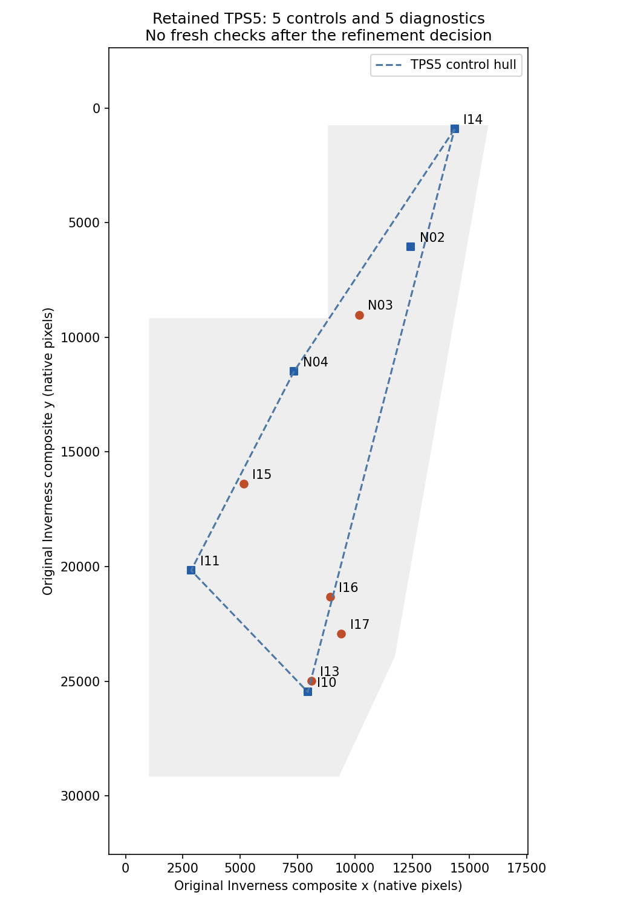
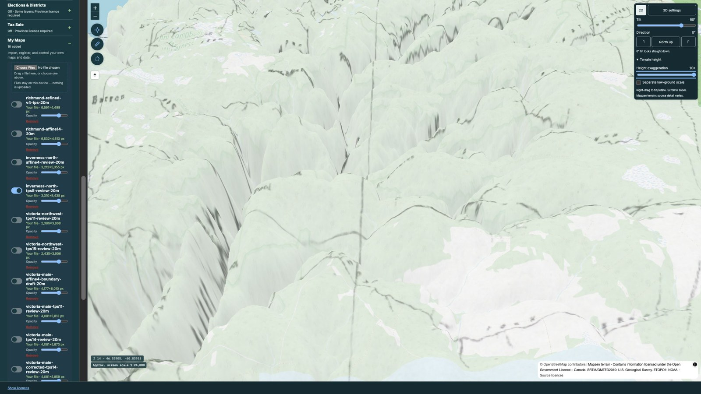
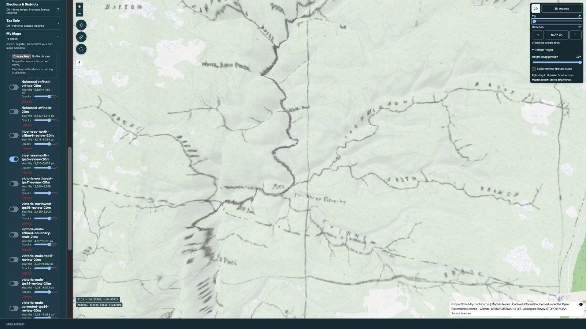

# Inverness north: rejected inland-support refinement, 16 September 2026

Retain the previous five-control TPS and its existing review raster. Adding a
well-defined Calumruadh fork improved the two model-selection diagnostics, but
worsened reserved North Branch validation from **94.72 m to 301.30 m**. The
six-control refinement is rejected. No whole-panel geographic acceptance,
replacement raster, catalog activation, tiles or deployment resulted.

## Evidence and experiment order

Original Inverness JP2 coordinates are unchanged: 34,427 × 34,543 pixels,
SHA-256 `37021ed086f7bbce542b519e9a74242acc5b53ed1944880468f6f91d6234a7f8`.
The [previous report](../inverness-north-continuation-20260914/README.md)
retains all earlier failed correspondence and fit histories. Frozen inputs are
pinned to nightly ancestor `b12848d94e76bacc3fc3da0c08cada7b7f7fb416`.

Two new original-scan junctions were placed and crosshair-reviewed before these
trials. I16 North Branch / Northeast Margaree uses native **8918, 21329** and
three original WARV50 endpoints **271011 v40 / 271193 v54 / 271195 v0**.
Its broad topology includes the downstream Jim Campbells Brook and pool sequence.
I17 Calumruadh / South Calumruadh uses **9403, 22927** and
**277740 v33 / 279457 v35 / 279458 v0**; the westward outlet and more southerly
Coinneach network distinguish the junction. Both have stated 180 m observation
uncertainty: these are generalized engraved junctions, with thick ink at I16 and
a short eastern-arm gap at I17. Reference coordinates are exact original vertices,
not inverse-fit predictions. The search guide is recorded separately.

I16 was reserved and never read by `run_trials.py`. It was identified before the
new freeze, so it is a reserved check, not a feature selected after freezing.
I17 first scored **246.45 m** against TPS5 before any promotion. Presquile I15
was re-reviewed unchanged; its original **416.61 m** first failure remains in the
previous report. Its broad western coastal extremum is still a coarse observation,
not a surveyed corner. Candidate promotions were tested without shifting pixels.

| Controls / method | N03 Pleasant Bay | I13 Second Fork | Same-two diagnostic RMS |
|---|---:|---:|---:|
| Previous TPS5 | 32.81 | 345.29 | 245.26 |
| Add Calumruadh, TPS6 | 23.77 | 308.94 | 219.10 |
| Add Presquile, TPS6 | 59.35 | 321.18 | 230.95 |
| Add both, TPS7 | 58.49 | 308.60 | 222.10 |

All values are horizontal ground metres. The four corresponding affine trials
had RMS 516.73–564.10 m. Every trial is preserved in `trial-results.json` and
`trials/`. The Calumruadh-only TPS6 was provisionally selected and frozen in
`selected/`; that directory preserves the selection **before its rejection**.
Adding Presquile worsened Pleasant Bay without a material gain at Second Fork.

After freezing TPS6, I16 scored **301.30 m**, residual −105.80 m east / +282.11 m
north. The previous TPS5 scored **94.72 m** on the exact same point. This reserved
failure rejected the added-control refinement. No subsequent pixel adjustment,
control promotion or model search followed. The planned TPS6 renderer was never
executed; no coverage/distortion claim is made for that rejected candidate.

## Retained result and validation roles

The retained TPS5 controls remain N02, N04, I10, I11 and I14. All five current
checks are now **diagnostic**, since they informed the current model decision or
were trial controls. The original first results and phase boundaries remain
intact. **There are zero fresh checks after this decision.**

| Diagnostic set | Count | RMS | Median | Empirical P95 | Maximum | Mean east / north |
|---|---:|---:|---:|---:|---:|---:|
| N03, I13, I15, I16, I17 | 5 | 269.66 | 246.45 | 402.35 | 416.61 | −97.48 / −174.26 |

Scatter about mean residual is 181.24 m. The metric uses the established mean-latitude
cosine ground-distance convention and NumPy linear empirical P95, not projected
Web Mercator distances or a confidence guarantee. This diagnostic result exceeds
the requested 250 m RMS working target. Five checks, including three in one inland
watershed, cannot establish whole-panel accuracy. Northern/intervening coast,
northern interior, edges and adjacent-sheet seams remain weakly assessed. Earlier
Blair, Corney and Lowland correspondence exclusions remain unchanged.

## Actual terrain review

The unchanged `inverness-north-tps5-review-20m` raster was isolated at 70% opacity
over OpenStreetMap in the actual web map, centred near Calumruadh at zoom 14.
Terrain exaggeration **10×** was verified at **50° and 0° tilt**. Oblique terrain
clarifies valley/ridge context but hides valley bottoms; top-down terrain exposes
more of the engraved water network. Several generalized historical channels do
not follow every modern valley. These views aid correspondence review and do not
supply control-point pixels or prove horizontal accuracy.

The retained raster SHA is
`8856e0fdd99f3ce01774f4ee22d182755728369961de9113f76af4cc047b62e8`.
Its previous full-cutline audit had zero holes across 10,084,453 interior cells
and 14,611 orientation samples without reversals (sampled, not continuous proof).
No bytes changed. Original JP2 / working TIFF parity remains limited to the
previously inspected native windows, not a claim of full-source parity.

## Reproduction and continuation

`PYTHONPATH=. /opt/local/bin/python3.12 reports/church/north-coast-refinement-20260916/verify_reports.py`
replays twelve metric sets, verifies the original crop hashes, exact reference
vertices, nightly ancestry and reserved-check isolation. Six editable inventories
round-trip through the production web parser. All 428 Church tests passed.
Large originals and native crops remain in the cache paths recorded in the
observations. Research evidence and failed trials are committed; accepted
baselines and production catalog state are untouched.

This bounded refinement did not produce a defensible improvement. Continue to
**Victoria northwest**, then **Victoria main** separately, retaining this north
result and its specific coast/interior support limitations for a future pass.
