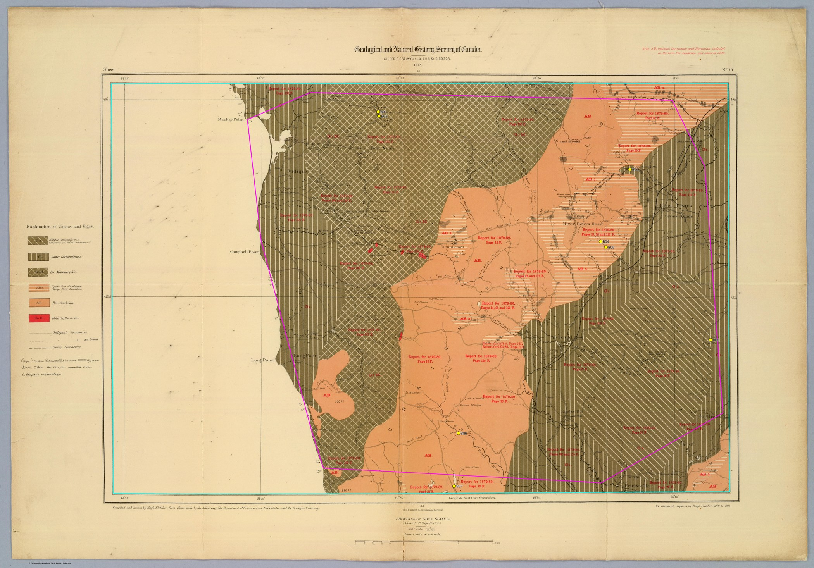
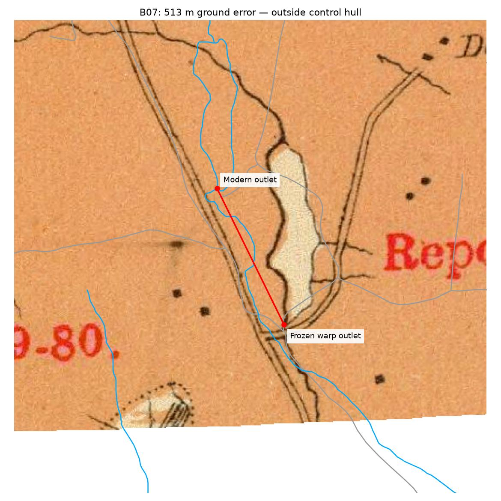

# Judique boundary: crop complete, full-sheet accuracy fails

The reversible map-content mask removes Sheet 19's printed frame, legend and
margins without changing the original 10815×7549 scan or any of its 39 controls.
Eight additional check points expose a southern-edge mismatch. **Judique is
still a draft and is not ready for a seamless full-sheet tileset.**

| Additional checks | Count | Median ground error | Worst ground error |
| --- | ---: | ---: | ---: |
| All | 8 | 120 m | 513 m |
| Inside existing control hull | 7 | 94 m | 181 m |
| Outside hull: southern lake outlet | 1 | 513 m | 513 m |

The frozen median ≤100 m / worst ≤200 m gate fails for the full additional set.
The inside-hull subset meets those error limits, but that does not establish
accuracy everywhere inside the hull. No sampled folds occurred at 71,285 sites
on a 25-native-pixel grid across the proposed content mask. Sampling cannot
prove the surface has no folds between sites.

## Evidence and provenance

[Protocol](PROTOCOL.md) was committed before annotation, and
[additional-checks.json](additional-checks.json) was committed before scoring.
The fit remains the exact `visual-expansion/sheet-observations.json` frozen in
the protocol. New checks never enter the TPS. Small native crosshair placement
corrections made before scoring are retained in the observations.

These are same-agent, visually matched checks, with prior exposure to the sheet.
Two neighbouring-fork pairs mean eight observations represent six localities;
they are not eight independent regions. Ambiguous rejected searches are recorded.
Native crosshairs and modern branch geometry are visible in
[checks B01–B04](check-evidence-1.jpg) and [checks B05–B08](check-evidence-2.jpg).



The southern lake's shape, two flanking roads and outlet crossing support its
identity. The overlay below shows the unchanged warp against modern water
linework. The outlet lies outside the control hull; the nearest control is
569 native pixels away. Lake-bank generalization contributes uncertainty, but
the observed displacement is much larger than the recorded 10-pixel placement
allowance. This establishes an alignment mismatch, not its sole cause: local
historical drawing error and insufficient surrounding controls need investigation.



## Crop and artifacts

[boundary.json](boundary.json) traces the inner printed neatline in original
scan coordinates. Native dark-line profiles and corner inspection locate the
line; an 8-pixel inward inset removes its ink and allows for interpolation
between samples. This inset is editable and is not a final mosaic seam.

The local output folder is `~/Downloads/judique-boundary-checks/result/`:

- `judique-neatline-diagnostic.tif`: 8399×5737 RGBA GeoTIFF, full map-content
  extent, including unsupported geography and the failed southern check.
- `judique-supported-preview.tif`: 6333×5430 RGBA GeoTIFF, conservative existing
  control hull. That hull is entirely inside the content mask, so their
  intersection equals the hull. This preview excludes the failed outlet.
- Matching PNG previews, native crosshairs, modern references, projected cutlines,
  raster metadata, and the lake overlay.

Both rasters use the frozen GDAL TPS, EPSG:3857, cubic resampling, and a shared
5-projected-metre working grid with transparent exteriors. The pixel size is
approximately 3.5 ground metres here; it is neither an accuracy claim nor the
final XYZ tile grid. Large rasters and the original scan stay outside Git.
[Artifact hashes](artifact-receipt.json) identify the exact outputs.

## Next geographic work

Printed adjoining-sheet numbers, cross-checked with the [inventory](../INVENTORY.md),
identify **16 north, 18 east, and 22 south**. Their shared geography is not yet
validated. Sheet 16 has saved hand controls; preserve them when it is reviewed.

1. Extend Judique's southern control coverage using additional persistent
   features around the lake and southern streams. Diagnose the displacement
   before revising the fit; keep B07 visible as a diagnostic check.
2. Check the southern join with Sheet 22, then the joins with Sheets 16 and 18.
   Reserve new verification features before accepting any revised warp.
3. Choose shared seam lines only after features agree across each join. Mosaic
   accepted coverage and generate tiles once on the same tile grid. The content
   mask alone cannot eliminate geographic gaps or duplicated roads/streams.

## Reproduction and verification

Requires Python with NumPy, SciPy, Pillow and Matplotlib, and GDAL CLI tools.
Use the native scan and the reference extracts named in
[reference-receipts.json](../matching-benchmark/reference-receipts.json).

```sh
python reports/fletcher/judique-boundary/build_boundary.py \
  --out /path/to/output \
  --source /path/to/native-sheet19/sheet19.png \
  --reference-dir /path/to/fletcher-matching-benchmark
```

`--score-only --out /path/to/output` replays scoring without imagery/reference
extracts. Source, reference and fit hashes are checked before rendering. A zero
process exit means the analysis completed; geographic acceptance is the explicit
`accuracy_gate_passed` field in [scores.json](scores.json), which is **false**.

Verified locally: full render and score replay, unchanged source/control hashes,
RGBA/transparent exteriors, shared grid origins, native crosshairs and lake overlay,
Ruff, and all 257 Fletcher pipeline tests. These new TIFFs have not been imported
in the browser; no production controls, application code or live tiles changed.

Imagery: David Rumsey Map Collection, David Rumsey Map Center, Stanford University
Libraries. CC BY-NC-SA 3.0 and the project's recorded permission apply; see the
[rights record](../INVENTORY.md). This project's crop, annotations and warp are
modifications. Modern vectors: Nova Scotia NSTDB 1:10k, with extract hashes above.
