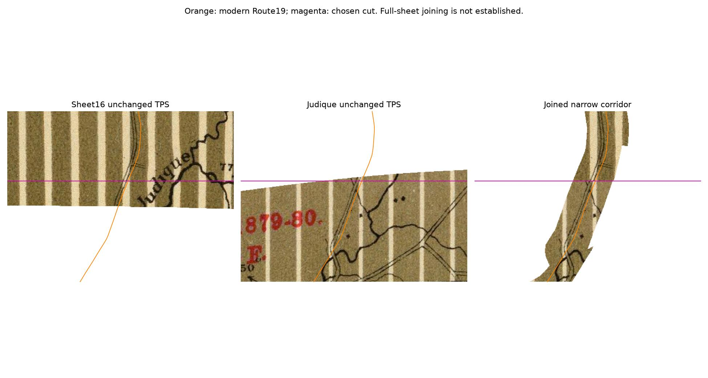

# Route 19: close the northern gaps and join Judique to Sheet 16

A narrow browsing preview now connects northern Judique to Mabou along Route 19,
including the two gaps left by Sheet 16's conservative control hull. The road
continues across a shared cut without changing either sheet's TPS controls.
This is a corridor preview, not a completed full-sheet mosaic or the finished
Port Hawkesbury–Mabou tileset.

## What changed

Preserve Sheet 16's 32 controls and Judique's 39 controls, including every saved
hand correction. Keep both previous cropped previews intact. Add small mask
extensions around the road at Port Hood and the northern Judique join, bounded
by the traced road and approximately 150 ground metres on either side. These
extensions use **limited extrapolation outside the original control hull**.
They are supported by lateral road checks, not new fitting controls or proof of
along-road accuracy.

The joined artifact shows a roughly 300 m wide corridor between latitude 45.91
and 46.08. Existing hull limits can narrow its edges. The broader individual
sheet previews retain their previous context plus the small extensions. Joining
those broader sheets everywhere is not validated by the narrow road seam.

## Evidence and limits

The protocol was committed before scoring. Three native road traces and two
stream checks were frozen in commit `ef132b25`. A fourth road trace, connecting
the join into the existing Judique hull, was selected after the first results
and frozen in `7407a780` before its own score. No trace or point entered a fit.
All source coordinates refer to the original scans; native crosshairs, road
traces, crop origins and display scales are included in this directory.

| Native road trace | Median sideways error | Worst sideways error |
| --- | ---: | ---: |
| Port Hood gap, Sheet 16 | 50 m | 69 m |
| Southern gap, Sheet 16 | 45 m | 64 m |
| Northern join, Judique | 31 m | 36 m |
| Continuation into Judique hull | 16 m | 109 m |

These are nearest distances to the NSTDB Route 19 highway line. The samples
are correlated and cannot detect displacement along a straight road. Each
trace passes the predeclared median ≤100 m / worst ≤200 m limits for this
lateral test. Historical road changes can also contribute to the measured
separation; the result is not an attribution of all error to georeferencing.
The labelled tramway at Port Hood was explicitly excluded from the road trace.
Its mining headland was rejected because the modern shoreline shape differs.

The separate stream checks measure **44 m** on Sheet 16 and **154 m** on
Judique. They are different nearby features, not a single shared tie point.
The Judique tributary's modern bank/centreline geometry is more complex than
the old drawing. Its 154 m result remains visible; it does not establish a
≤100 m local positional accuracy. Two checks cannot validate the surrounding
terrain. See `stream-checks.jpg` and the frozen feature IDs in `observations.json`.

Across the overlapping road traces, the two sheets differ sideways by at most
**11.3 m**. A cut at latitude **45.92450915**, snapped to the existing 5 m
projected grid, makes the interpolated road centres meet to within one output
pixel. The raw computed step is about 0.07 m, which is computational continuity,
not sub-metre map accuracy. The cut was selected using those traces and is not
an independent accuracy check. Geological stripe phases, paper colour and
unverified off-road features can still differ between sheets.



The final raster has no transparent cells along the tested NSTDB Route 19
centreline between 45.9101 and 46.0799. Every output cell touched by that line
was checked, as were 4,469 reference samples and 303 transformed old-road trace
samples. This verifies coverage, not geographic accuracy or complete modern
road-network data. `coverage.json` retains the exact counts and bounds.

## Artifacts

Local result directory: `/Users/dfakkeldy/Downloads/fletcher-route19-seam/result/`.

| File | Dimensions | Purpose |
| --- | --- | --- |
| `judique-mabou-route19-preview.tif` | 3599×5449 | Joined narrow corridor, approximately 2.1 MB |
| `sheet16-corridor-preview.tif` | 6793×5448 | Previous Sheet 16 hull plus the small extensions |
| `sheet19-corridor-preview.tif` | 6333×5535 | Previous Judique hull plus the northern road extension |

All three are RGBA GeoTIFFs in EPSG:3857, retaining the existing 5 projected-metre
grid. This pass crops and mosaics already-warped pixels with nearest-neighbour
resampling. It does not refit, stretch, feather or colour-match the scans.
`artifact-receipt.json` records source/output hashes and the cut coordinate.
The editable masks are ordinary GeoJSON, separate from the original scans.

## Verification and reproduction

- Fresh score replay matches `scores.json` and `curves.json` exactly; input fit,
  source and reference hashes are checked.
- Every final raster has exactly RGB plus one declared alpha band. An initial
  GDAL multi-input warp produced an extra alpha band; explicit source-alpha
  handling corrected it before delivery. A duplicated reference vertex is
  ignored as a zero-length segment, preventing undefined distance calculations.
- All **271** existing Fletcher unittest tests pass. Ruff check/format pass.
- Playwright imported the actual joined TIFF through NSMtS, rendered it,
  preserved its original 3599×5449 dimensions and geotransform, and verified
  its identical stored hash and enabled state after reload. The display preview
  is 2705×4096. Desktop/mobile layouts and the Port Hood gap were inspected;
  console/runtime errors were empty. Only the joined TIFF was browser-tested
  in this pass. This is local Chromium verification, not deployment or iOS QA.

With GDAL/OGR (including SQLite/GEOS), NumPy, SciPy, Pillow and Matplotlib:

```sh
python reports/fletcher/route19-seam/score.py \
  --out /path/to/result --reference-dir /path/to/sheet16/reference
python reports/fletcher/route19-seam/render.py \
  --out /path/to/result --reference-dir /path/to/sheet16/reference \
  --sheet16-dir /path/to/previous-sheet16/result \
  --judique-dir /path/to/judique-boundary-checks/result
python reports/fletcher/route19-seam/evidence.py \
  --out /path/to/result --reference-dir /path/to/sheet16/reference \
  --source16 /path/to/native/sheet16.png --source19 /path/to/native/sheet19.png
python -m unittest discover -s tools/fletcher/tests -q
```

Next geographic work should continue south through Judique toward Port
Hawkesbury, preserving the recorded southern Judique/Sheet 22 failures until
repaired and independently checked. Wider seamless coverage needs checks away
from Route 19 before selecting full-width sheet seams. No live layer or tiles
were replaced.

Imagery: David Rumsey Map Collection / David Rumsey Map Center, Stanford
University Libraries, CC BY-NC-SA 3.0 and recorded project permission; see
[the rights record](../INVENTORY.md). Crop and mosaic are modifications.
Modern references: Nova Scotia NSTDB, with hashes in the Sheet 16 receipts.
