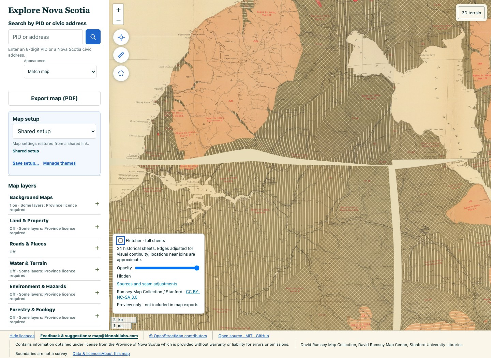
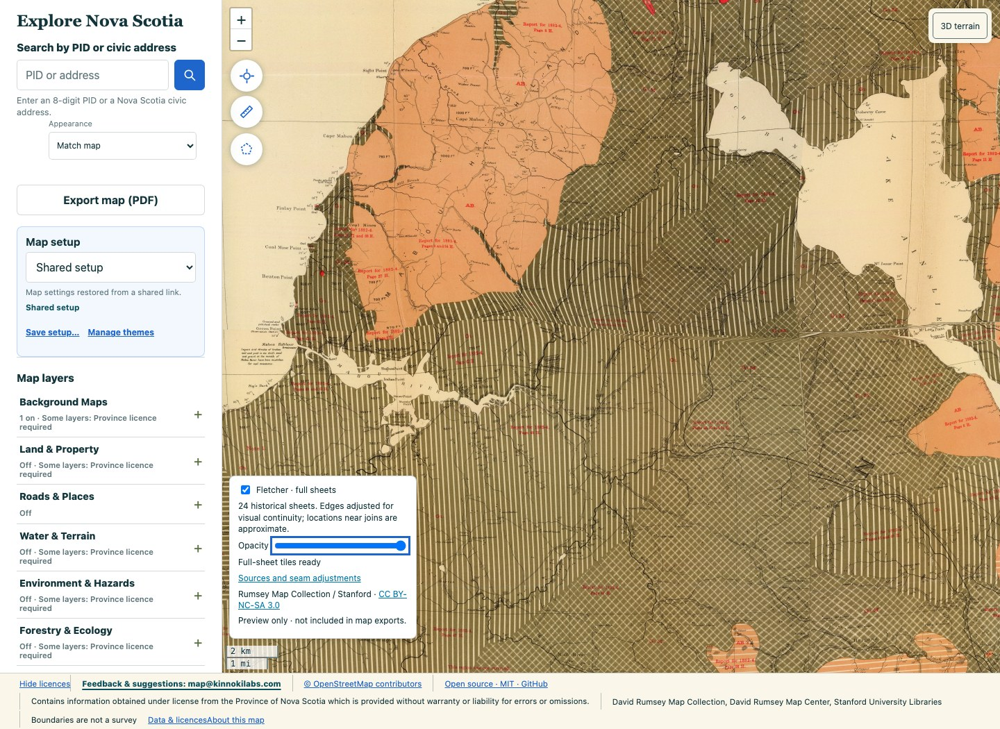

# Fletcher sheet-gap repair — 9 October 2026

This is a cartographic repair of the transparent strips between Fletcher sheets.
The user explicitly preferred visual continuity over geographic accuracy for the
1884 mosaic. Existing source scans, geographic controls, checks and published
revision remain unchanged. No new geographic accuracy is claimed.

The reported horizontal Mabou seam is between sheets 14 and 16; the vertical
seam is between sheets 15 and 16. The earlier geographic refinements deliberately
retained these gaps. Adding synthetic geographic controls would conceal the
actual purpose of this adjustment, so it is applied separately to the rendered
mosaic.

## Method

`tools/fletcher/close_seams.py` verifies the existing 24-sheet mosaic and each
source raster against the frozen September 13 manifest. It reconstructs the
source-sheet owner of each covered cell in the original compositing order.
Only bounded gaps between different neighbouring sheets are eligible. The
reviewed frame-neighbour list is in `pairs.json`; it includes diagonal neighbours
at sheet-corner junctions. It does not extend the outer frame or bridge the large
unmapped region east of sheet 15.

Each side of an eligible gap stretches to its midpoint. A smoothstep displacement
fades to zero within the adjacent imagery. The minimum inward support is 3,000
**projected** metres, expanding to four times the gap width where space permits;
it is limited to half the contiguous supported run. The source support must be
at least the gap width. The separately reviewed 08–09 highland wedge uses an 8,000 projected-metre
limit in a regional follow-up; other gaps over 3,000 projected metres stay open. These are
cartographic parameters, not geographic error tolerances; EPSG:3857 distances
are larger than ground distances here.

Horizontal, vertical, then horizontal passes handle long seams and their corner
junctions. Small raster-edge cracks (up to eight native cells) separated by a
sliver of at most 32 cells are grouped with an adjacent inter-sheet gap. Isolated
same-sheet holes and small detached islands are not expanded. Every remapped
sample comes from existing source imagery; there is no inpainting or geology
synthesis. Bilinear resampling may alter individual colour values. Original
opaque coverage must survive every pass, and newly covered cells must equal the
eligible gap cells. Each scanline's source mapping must remain strictly monotone.

The result closes transparent strips; it does not assert that every road,
watercourse, hatch or label meets exactly. Printed differences and tangential
misalignments can remain visible at a join. Historical point annotations remain
on their existing geographic fit and are not silently repositioned by this
imagery-only adjustment.

## Reproduction

Use Python with NumPy, Pillow and the GDAL bindings/CLI. Large imagery stays
outside Git. The script refuses an existing output owner raster, verifies input
hashes before editing, and removes only its own reproducible intermediate rasters
after the following pass completes. Pass receipts are retained.

```sh
python -m tools.fletcher.close_seams \
  --source "$HOME/Downloads/fletcher-retile-20260913/fletcher-24-full-sheets.tif" \
  --inputs reports/fletcher/retile-20260913/inputs.json \
  --pairs reports/fletcher/seam-repair-20261009/pairs.json \
  --out "$HOME/Downloads/fletcher-seams-20261009-final"
python reports/fletcher/seam-repair-20261009/finish_mosaic.py \
  --directory "$HOME/Downloads/fletcher-seams-20261009-final" \
  --out "$HOME/Downloads/fletcher-seams-20261009-delivery"
python tools/fletcher/tile_full_sheets.py \
  --source "$HOME/Downloads/fletcher-seams-20261009-delivery/fletcher-cartographic-mosaic.tif" \
  --inputs "$HOME/Downloads/fletcher-seams-20261009-delivery/inputs.json" \
  --out "$HOME/Downloads/fletcher-seams-20261009-delivery/fletcher-seams-20261009.2" \
  --revision fletcher-seams-20261009.2 \
  --name "Fletcher 24 sheets — cartographic seam repair"
```

The optional local web preview uses `VITE_FLETCHER_FULL_SHEETS_TILE_BASE_URL` and
revision `fletcher-seams-20261009.2`. It explicitly identifies the aesthetic edge
adjustment, retains source/licence links, and is excluded from print/export.
The normal web and native layers keep their published September 13 revision.

Historical imagery: David Rumsey Map Collection / David Rumsey Map Center,
Stanford University Libraries, CC BY-NC-SA 3.0, with the existing project
permission receipts retained. This generated derivative is not MIT-licensed
imagery. Local rendering, tile verification, browser review, CI, merge and public
publication remain separate results.

## Verified result




The final revision is `fletcher-seams-20261009.2`. The GeoTIFF and complete
8–15 tile pyramid are in `~/Downloads/fletcher-seams-20261009-delivery/`.
The source raster remains 34,412 × 56,464 cells, EPSG:3857, with 5 projected-metre
cells. The finishing step includes vertical and horizontal cleanup around the
08–09–10–11 junction after closing the wide wedge.

- Final coverage check: 14,051,684 previously transparent cells now covered; zero original coverage lost. 959,705,590 original covered cells remain byte-identical. See [coverage receipt](coverage-verification.json).
- Tile check: all 44,340 hashes and XYZ addresses verified; 1,231,829,117 native-zoom opaque cells compared; zero missing coverage and zero tile-edge RGB difference. Maximum interior rounding difference: 1 level. See [tile receipt](tile-verification.json).
- Geographic fits: [all 24 unchanged](fit-preservation.json). This is an aesthetic adjustment, not improved positional accuracy.
- Browser: actual app/local tiles at 1440 and 390 pixels; opacity, keyboard toggle and reload pass, no overflow or console/page errors. Unrelated remote services were isolated with fixtures. See [browser receipt](browser-verification.json) and [review images](review-images.json).
- Automated checks: 310 Fletcher tests; 2,489 web tests passed with one existing skip; lint and production build passed. See [checks](checks.json).
- Publication plan: 5,572 changed tiles (537,431,970 bytes), 38,768 byte-identical tiles that can be copied from the existing immutable revision, and two new manifests. [Comparison](upload-comparison.json). No public upload or live pin change has been performed.

Remaining small corner/edge slivers are explicitly retained in
[the post-repair audit](remaining-audit-final.json); it samples every 100
projected metres and is not a proof of zero transparency everywhere. Unsupported
outer edges and the large missing sheet area remain uncovered. The long reported
Mabou strips and the wider northern wedge are closed. Adjacent printed features
can still have visible discontinuities.
