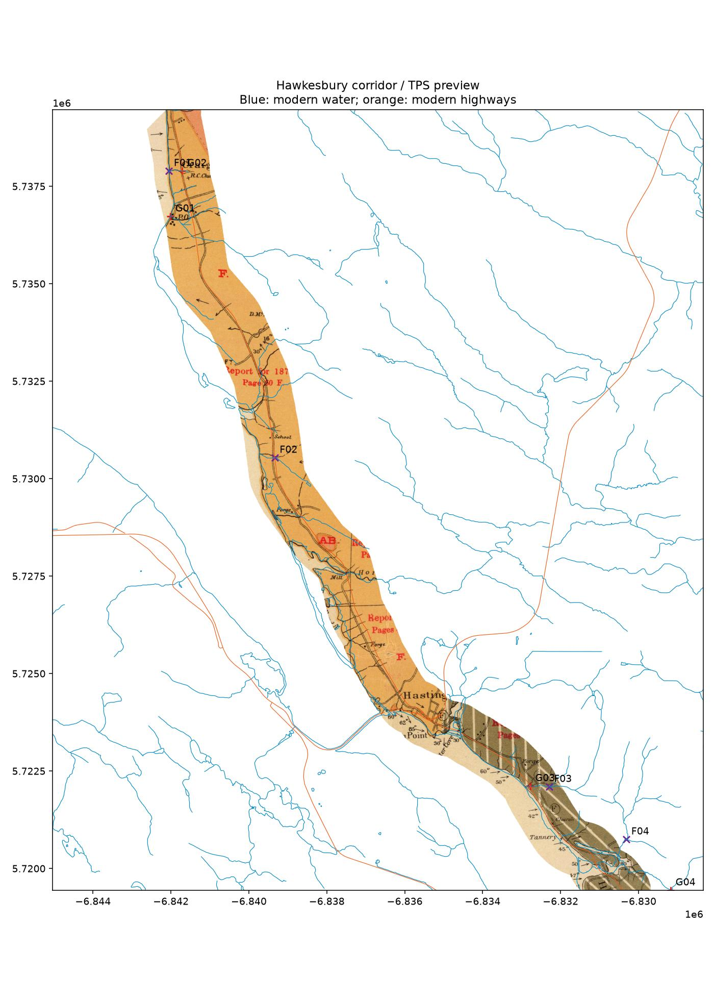

# Sheet 22 / Hawkesbury: checked road-corridor preview

A cropped TPS preview now covers the checked portion of the requested corridor,
from Craignish through Troy and Port Hastings into northern Port Hawkesbury.
It preserves all **17 saved hand controls**, adds two verified coastal controls,
and passes the established browsing gate on four fresh check positions:
**91.66 m median, 165.20 m worst** (limits 100 m / 200 m ground error).

This is limited corridor acceptance. The whole sheet still fails: the revised
TPS has 151 m median / 304 m worst error on the original eight Q checks.
The mainland, eastern mountains, southern town and Judique–Hawkesbury seam are
not certified by this result. No live layer or tileset was replaced.



## Geographic evidence and retained failures

The original scan is Sheet 22 / Hawkesbury, Rumsey catalogue **3997.024**,
`RUMSEY~8~1~2647~290015`, 1:63,360, **10790 × 7687** native pixels. Its SHA-256 is
`b2dd6efed654eba240b0db7077c760577154ed049e86ce001573c1bb41b10ed9`.
Source provenance/permission remains in the [Fletcher inventory](../INVENTORY.md)
and the [original Sheet 22 report](../sheet22/README.md).

[Modern reference receipts](reference-receipts.json) identify the NSTDB water,
roads, highways, rail and water polygons, bounding box, retrieval dates, feature
counts and hashes. Extracts and point coordinates are longitude/latitude in
EPSG:4326; fitting uses EPSG:3857; reported errors are approximate spherical
ground distances, not projected metres. Source pixels use the original,
unrotated scan's image-edge frame. Crop boxes and display scales are recorded.

| Frozen fit and evaluation | Median | Worst | Interpretation |
|---|---:|---:|---|
| 17 saved controls, affine, new C checks | 101.41 m | 109.41 m | Failed; retained |
| 19 controls, affine, fresh F checks | 116.62 m | 128.98 m | Failed; retained |
| 19 controls, TPS, F checks | 65.96 m | 127.36 m | Model-selection diagnostic |
| 19 controls, TPS, fresh G checks | **91.66 m** | **165.20 m** | Pass for limited browsing corridor |

The original 17-control affine scores 155.58 / 199.27 m on the same final G
positions. The TPS comparison improves that baseline, but this is not a
measurement of the published Rumsey layer.

C01 and C02 were explicitly consumed and promoted to N01/N02 controls. The
failed original [C result](initial-affine-scores.json) and [observations](checks.json)
remain intact. The revised affine was frozen in `fbff74f4b` before selecting F;
F was frozen in `d951d239`. After its failure, the unchanged 19-control TPS was
frozen in `2bbb14de`, and G was frozen in `536f298c` before scoring. F now supports
model selection, not fresh validation of the selected TPS. No F or G point is
fitted. Full comparisons, including failed whole-sheet Q results, are in
[scores.json](scores.json).

Fresh G checks are a creek mouth and road crossing in Craignish, a brook
crossing in northern Hawkesbury, and a southeastern Emery Brook confluence.
They are clustered at the corridor's northern/southern ends; Troy's F02 is
useful diagnostic evidence between them. Several checks share catchments with
earlier checks, so these are not independent catchment samples. Review was by
the same agent, not an independent survey. The user's general agreement with
previously inspected points is not recorded as a specific audit of these points.

Native crosshair audits and modern topology appear in [C evidence](C-evidence.jpg),
[F evidence](F-evidence.jpg) and [G evidence](G-evidence.jpg). Ambiguous wharf,
pond, geological-line and tributary candidates are explicitly rejected in the
observation files, before their scoring.

## Crop and usable files

The output is `hawkesbury-corridor-preview.tif`: **2588 × 4007**, 3.51 MB, RGBA,
EPSG:3857, 5 projected metres per output cell. It uses a nominal 500 ground metre
half-width around Route 19 and the Highway 4 connection east of Port Hastings,
clipped to the hull of observed positions and the original reversible native
content boundary. Hard latitude limits are **45.6185999–45.7442922**. The hull
limits extrapolation; it does not establish accuracy throughout its interior.

Route 19 ends at Port Hastings; the connection into town uses Highway 4. The
mask excludes mainland Highway 4. The crop removes collars and makes the area
outside the supported corridor transparent. It is a corridor preview, not a
finished full-sheet neatline or a seamless multi-sheet tileset. G04 is an inland
check near the southern latitude limit; it is outside the narrow road strip.

Large files are in `~/Downloads/fletcher-sheet22-corridor/result/`:

- `hawkesbury-corridor-preview.tif` — import directly through NSMtS My Maps.
- `hawkesbury-controls-checks.csv` — editable original-scan coordinates; all
  saved numeric control strings retained, with control/check roles separated.
- `corridor-preview.png` — quick transparent overview.

The [artifact receipt](artifact-receipt.json) records exact hashes and dimensions.
The [cutline](corridor-cutline.geojson), [editable CSV](hawkesbury-controls-checks.csv)
and [19-control observations](revised-observations.json) are also in Git.
The source image is unchanged and remains outside Git.

## Verification

- All 271 existing Fletcher unit tests passed; Ruff and `git diff --check` passed.
- A fresh score replay exactly matched the saved scores.
- SciPy and GDAL TPS predictions agree within 0.001 projected metre on G.
  That checks solver mechanics, not feature identity.
- 4,730 sampled local Jacobians have the expected negative orientation for
  native y-down coordinates. Sampling is not a continuous no-fold proof.
- 3,044 road samples have nonzero output alpha, at spacing no greater than
  10 projected metres, excluding a 10 m margin at the deliberate end cuts.
  See [render verification](render-verification.json).
- Actual NSMtS TIFF import, canvas render, desktop/mobile view and save/reload
  passed with zero console/page errors. The stored TIFF hash and dimensions
  survive reload; the preview retains all 2588 × 4007 pixels and transparency.
  See [browser receipt](browser-verification.json), [Troy](browser-troy.png),
  [Hawkesbury](browser-hawkesbury.png), and [mobile](browser-mobile.png).
  These checks use a separate Playwright profile; they do not alter the user's
  production browser. The Browser plugin was unavailable.

Reproduce with GDAL/OGR on PATH and NumPy, SciPy, Pillow, Matplotlib installed:

```sh
python reports/fletcher/sheet22-corridor/build.py \
  --out /path/to/output --source /path/to/native/sheet22.png \
  --reference-dir /path/to/sheet22/reference
python reports/fletcher/sheet22-corridor/verify_artifact.py --out /path/to/output
```

Add `--score-only` to replay geography without source/reference rasters.
For the browser check, run the web development server on port 4197, then:

```sh
node reports/fletcher/sheet22-corridor/verify-browser.mjs \
  /path/to/output/hawkesbury-corridor-preview.tif /path/to/browser-evidence
```

Next, check the southern Judique–northern Hawkesbury overlap before joining this
to the Judique–Mabou preview. The recorded 513 m southern Judique lake error is
still unresolved. Extend southern town coverage only after fresh checks support
it; neither a crop nor a passing corridor median resolves those gaps.
