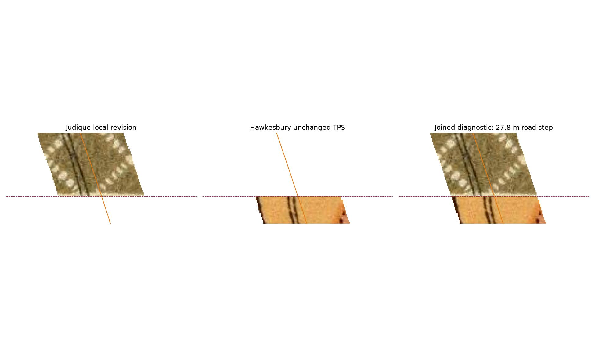

# Judique–Hawkesbury seam: accepted for approximate corridor browsing

The combined preview now has continuous raster coverage along the tested
Route 19 centreline from Port Hastings to Mabou. It includes the existing
Highway 4 corridor into northern Port Hawkesbury. On 2026-09-07 the user accepted
the current join for **approximate corridor browsing**, including its **27.79 m road-centre step**. The original 25 m
working target still fails; this specific browsing exception does not change
the measurements or establish a new tolerance for other seams. This is not a
seamless tileset or a published replacement layer.

The accepted downloads are in `~/Downloads/fletcher-southern-seam/accepted/`:

- `hawkesbury-mabou-browsing-preview.tif` — the combined corridor.
- `judique-hawkesbury-browsing-detail.tif` — full-resolution southern join.
- `browsing-acceptance.json` — acceptance scope, original hashes and limitations.

They are byte-identical copies of the original diagnostic TIFFs. The
[acceptance record](browsing-acceptance.json) is separate from the preserved
original failed scores and artifact receipt.

### Colour review

The dominant contrast is printed olive hatching versus orange map fill, visible
inside the frames in the [Judique edge](colour-review-sheet19.png) and
[Hawkesbury edge](colour-review-sheet22.png). The paper outside the frames is
much closer in colour. No reliable paper-only correction was identified that
would remove this contrast while preserving the printed information. Blending
displaced road linework could also create a doubled road. The delivered version
therefore preserves the source colours and sharp linework; the visible colour
seam remains. The earlier suggestion to blend paper colours overstated how
much that would help this particular join.



## Geographic work

The 39 original Judique controls and 19 Hawkesbury controls remain unchanged.
Two new physical checks first measured 29.09 m at the southern Judique creek
mouth (P19) and 46.44 m at the northern Craignish road crossing (P22). Native
road traces gave an initial minimum seam step of 28.61 m, which failed the
limit. The original [scores](initial-scores.json), [curves](initial-curves.json)
and [frozen observations](observations.json) are retained.

P19 was explicitly consumed as **S01**, a new control in a 40-control Judique
TPS. It corrects a measured creek-mouth position south of the old coastal
control hull; it is not a fabricated inter-sheet tie. The revised model was
frozen in `85f5e9b8`, then two different creek road crossings were frozen in
`3d6a50fb` before scoring. Those fresh checks give **18.85 m median / 19.82 m
worst** ground error. Both creek mouths are controls, so the check positions
have weak spatial independence; this only supports a small road-corridor patch.
P22 checks the unchanged Hawkesbury warp. P19's zero revised residual is a
fitting result, not validation.

The revised Judique warp is used only between approximately **45.74742 and
45.75902 latitude**. The preceding 39-control warp remains in use farther
north, with a measured road step of 0.38 m at that transition. Hawkesbury keeps
its existing 19-control TPS. The known 513 m inland lake mismatch is outside
this local patch/corridor and remains unresolved.

| Check | Median ground error | Worst ground error | Meaning |
|---|---:|---:|---|
| Fresh local Judique creek crossings | 18.85 m | 19.82 m | Geographic check, two nearby-to-control positions |
| Southern Judique road, revised local warp | 22.73 m | 57.11 m | Lateral distance only |
| Northern Hawkesbury road, unchanged warp | 32.83 m | 63.05 m | Lateral distance only |
| Long Point road, unchanged Judique warp | 44.75 m | 137.54 m | Lateral distance only |

The browsing gate is median ≤100 m / worst ≤200 m. Road samples are correlated
and cannot detect along-road displacement. These results do not accept
mountainous or wider sheet coverage.

The revised minimum road step is 27.13 m. Rounding the cut inward onto the
5 m projected raster grid gives the delivered **27.79 m**, still a failure
against the original target. The recorded target was not relaxed and source
coordinates were not moved to make it pass. [Scores](scores.json) separate this failure from passing local geography.
A nearby old road junction was rejected as a further anchor: the modern road
network does not establish an unambiguous surviving counterpart. Smaller
coastal marks were also excluded where modern hydrography did not identify them.

See [physical check evidence](physical-checks.jpg), [Judique trace](L19-trace.png),
[Hawkesbury trace](L22-trace.png), and [Long Point trace](L19M-trace.png).
Annotations are same-agent visual work, not independent surveying or a claim
that the user specifically reviewed these points.

## Crop and coverage repairs

Native edge inspection recovered four pixels from Judique's conservative
8-pixel inset and seven pixels from Hawkesbury's 12-pixel inset, only in small
rectangles around the road. The recovered pixels are map interior before the
printed frame ink. Original scans and original masks remain intact.
[Edge-recovery boxes](observations.json) record exact source coordinates.

The combined coverage test exposed an additional conservative-hull gap around
Long Point, at approximately 45.791–45.800 latitude. A native road trace was
frozen in `22d7ea4d` before scoring against the unchanged 39-control TPS. Its
passing lateral checks support a narrow mask extension around the traced road,
using already-warped original pixels. This is disclosed limited extrapolation
outside the previous hull, not new fitting controls or general area acceptance.

Final [coverage checks](coverage.json) find **zero transparent samples out of
10,462**, and **zero transparent cells out of 21,568 output cells touched by
the modern Route 19 line**. The checked range is 45.6473–46.0799 latitude.
Duplicate source segments do not turn these into independent observations.
Coverage is a raster-mechanics result; it does not override the failed 25 m
comparison. Browsing acceptance is the separate user decision recorded above.
The Highway 4 section retains the preceding Hawkesbury artifact and its checks.

## Artifacts and browser verification

Local folder: `~/Downloads/fletcher-southern-seam/revised/`.

| File | Dimensions | Use |
|---|---|---|
| `hawkesbury-mabou-joined-diagnostic.tif` | 4010 × 14749 | Entire combined corridor; 7.14 MB |
| `judique-hawkesbury-seam-detail.tif` | 445 × 542 | Full-resolution close inspection of this join |
| `judique-local-controls-checks.csv` | 40 controls + 2 checks | Editable original Sheet 19 scan coordinates |

Both TIFFs are RGBA, EPSG:3857, with 5 projected-metre cells. This is about
3.5 ground metres per output cell, not a positional accuracy claim. Hashes,
source provenance, actual seam coordinate and changed region appear in
[the artifact receipt](artifact-receipt.json). No imagery is invented, feathered
or stretched to hide the remaining step. Prior rasters are preserved.

The CSV describes the new **local** 40-control warp. It is not approved as a
whole-sheet replacement for Judique's prior controls. Do not attach its native
pixel coordinates to an already-warped TIFF. Editable crop GeoJSON and the
[revised observations](revised-judique.json) preserve the source frame.

The actual combined TIFF and the detail TIFF were imported through NSMtS,
rendered, reloaded, and inspected on desktop and mobile in separate Playwright
profiles. Stored source hashes, original dimensions, alpha and enabled state
survived. Browser console/page errors were empty. The Browser plugin was
unavailable. No production browser records changed.

NSMtS caps a single display preview at 4096 pixels: the long raster displays as
1114 × 4096 and is visibly soft at close zoom. The full original TIFF is still
preserved. Use the separate detail TIFF for inspection; its 445 × 542 preview
retains every output pixel. See [combined receipt](browser-verification.json),
[detail receipt](browser-detail-verification.json), [detail render](browser-detail.png)
and [Long Point render](browser-longpoint.png).

## Verification and reproduction

All 271 Fletcher tests pass. Ruff, JavaScript syntax and diff checks pass. Fresh
replay matches scores/curves exactly. The 39 previous Judique control records
are checked unchanged. Independent SciPy/GDAL TPS results agree within 0.001
projected metre on the fresh checks; 1,995 local Jacobian samples have the
expected orientation. This checks mechanics, not independent feature identity
or a continuous no-fold proof. See [warp verification](warp-verification.json).

Requires GDAL/OGR with SQLite/GEOS, NumPy, SciPy, Pillow and Matplotlib:

```sh
python reports/fletcher/southern-seam/score.py --out OUT \
  --reference-dir SHEET22_REFERENCE --north-reference-dir JUDIQUE_REFERENCE
python reports/fletcher/southern-seam/render.py --out OUT \
  --source19 NATIVE_SHEET19 --source22 NATIVE_SHEET22 \
  --reference-dir SHEET22_REFERENCE --north-reference-dir JUDIQUE_REFERENCE \
  --previous-north JUDIQUE_MABOU_TIFF --previous-judique JUDIQUE_SUPPORTED_TIFF \
  --previous-hawkesbury HAWKESBURY_CORRIDOR_TIFF --allow-diagnostic
python reports/fletcher/southern-seam/evidence.py --out OUT \
  --source19 NATIVE_SHEET19 --source22 NATIVE_SHEET22 \
  --reference-dir SHEET22_REFERENCE
```

The renderer refuses this failed seam without the explicit `--allow-diagnostic`
flag. The prior Judique neatline diagnostic must be beside its supported TIFF.
With the NSMtS development server on port 4197, run `verify-browser.mjs` with
TIFF path and output directory arguments. It supports the combined and detail
TIFF names above.

The original diagnostic renderer and its 25 m guard remain unchanged. To
reproduce the accepted exports, render the diagnostics, verify their hashes
against the acceptance record, then copy the two TIFFs to the accepted names
listed above without altering their contents. Acceptance applies to those
recorded hashes; changed imagery or fitting needs its own review.

Further geographic improvement would require a defensible additional constraint
near the road join and fresh checks. It no longer blocks this accepted browsing
preview. Wider sheet seams, southern town and the inland lake remain separate
work. Final tile publication has not been performed.

Imagery: David Rumsey Map Collection / David Rumsey Map Center, Stanford
University Libraries; CC BY-NC-SA 3.0 and recorded project permission. Crop,
annotations and warp are modifications; see [rights](../INVENTORY.md).
Source/reference hashes reuse the preceding Judique, Hawkesbury and
[road-context receipts](../placement-pilot/road-context-receipts.json).
